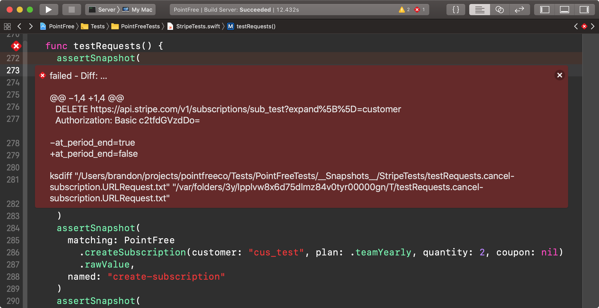

# 📸 SnapshotTesting

[](https://swift.org/download/) [](https://circleci.com/gh/pointfreeco/swift-snapshot-testing) [](https://travis-ci.org/pointfreeco/swift-nonempty) [](https://twitter.com/pointfreeco)

Delightful Swift snapshot testing.

<!--

-->

## Usage

Once the library [is installed](#installation), _no additional configuration is required_. You can import the `SnapshotTesting` module and call the `assertSnapshot` function.

``` swift
import SnapshotTesting
import XCTest

class MyViewControllerTests: XCTestCase {
  func testMyViewController() {
    let vc = MyViewController()

    assertSnapshot(matching: vc, as: .image)
  }
}
```

When the test first runs, a snapshot is automatically recorded to disk and the test will fail, printing out the file path of the newly-recorded reference.

> 🛑 failed - Recorded: …
>
> "…/MyAppTests/\_\_Snapshots\_\_/MyViewControllerTests/testMyViewController.png"

Repeat test runs will load this reference for comparison. If the values don't match, the test will fail and describe the difference.

You can record a new reference by setting the `record` mode to `true` on the assertion or globally.

``` swift
assertSnapshot(matching: vc, as: .image, record: true)

// or globally

record = true
assertSnapshot(matching: vc, as: .image)
```

## Snapshot Anything

While most snapshot testing libraries in the Swift community are limited to `UIView`s and `UIImage`s, SnapshotTesting can work with _any_ value and _any_ format on _any_ Swift platform!

The `assertSnapshot` function accepts a value and any snapshot strategy that value supports. This means that a [view](Documentation/Available-Snapshot-Strategies.md#uiview) or [view controller](Documentation/Available-Snapshot-Strategies.md#uiviewcontroller) can be tested against an image representation _and_ against a textual representation of its properties and hierarchy.

``` swift
assertSnapshot(matching: vc, as: .image)
assertSnapshot(matching: vc, as: .recursiveDescription)
```

View testing is highly configurable. You can generate device-agnostic snapshots from a single simulator.

``` swift
assertSnapshot(matching: vc, as: .image(on: .iPhoneSe))
assertSnapshot(matching: vc, as: .image(on: .iPhoneSe(.landscape)))
assertSnapshot(matching: vc, as: .image(on: .iPhoneX))
assertSnapshot(matching: vc, as: .image(on: .iPadMini(.portrait))
```

Better yet, SnapshotTesting isn't limited to views and view controllers! There are [a number of available snapshot strategies](Documentation/Available-Snapshot-Strategies.md).

For example, you can snapshot test URL requests (_e.g._, those that your API client prepares).

``` swift
assertSnapshot(matching: urlRequest, as: .raw)
// POST http://localhost:8080/account
// Cookie: pf_session={"userId":"1"}
//
// email=blob%40pointfree.co&name=Blob
```

And you can snapshot test `Encodable` values against their JSON _and_ property list representations.

```
assertSnapshot(matching: user, as: .json)
// {
//   "bio" : "Blobbed around the world.",
//   "id" : 1,
//   "name" : "Blobby"
// }

assertSnapshot(matching: user, as: .plist)
// <?xml version="1.0" encoding="UTF-8"?>
// <!DOCTYPE plist PUBLIC "-//Apple//DTD PLIST 1.0//EN" "http://www.apple.com/DTDs/PropertyList-1.0.dtd">
// <plist version="1.0">
// <dict>
//   <key>bio</key>
//   <string>Blobbed around the world.</string>
//   <key>id</key>
//   <integer>1</integer>
//   <key>name</key>
//   <string>Blobby</string>
// </dict>
// </plist>
```

In fact, _[any](Documentation/Available-Snapshot-Strategies.md#any)_ value can be snapshot-tested by default using its [mirror](https://developer.apple.com/documentation/swift/mirror)!

``` swift
assertSnapshot(matching: user, as: .dump)
// ▿ User
//   - bio: "Blobbed around the world."
//   - id: 1
//   - name: "Blobby"
```

If your data can be represented as an image, text, or data, you can write a snapshot test for it! Check out [all of the snapshot strategies](Documentation/Available-Snapshot-Strategies.md) that ship with SnapshotTesting and [learn how to define custom strategies](Documentation/Defining-Custom-Snapshot-Strategies.md).

## Installation

### Carthage

If you use [Carthage](https://github.com/Carthage/Carthage), you can add the following dependency to your `Cartfile`:

``` ruby
github "pointfreeco/swift-snapshot-testing" "master"
```

### CocoaPods

If your project uses [CocoaPods](https://cocoapods.org), add the pod to any applicable test targets in your `Podfile`:

```ruby
target 'MyAppTests' do
  pod 'SnapshotTesting', :git => 'https://github.com/pointfreeco/swift-snapshot-testing.git'
end
```

### Swift Package Manager

If you want to use SnapshotTesting in a project that uses [SwiftPM](https://swift.org/package-manager/), add the package as a dependency in `Package.swift`:

```swift
dependencies: [
  .package(url: "https://github.com/pointfreeco/swift-snapshot-testing.git", .branch("master")),
]
```

## Features

- **Snapshot test _anything_.** Snapshot testing isn’t just for UI. Write snapshots against _any_ format.
- **No configuration required.** Don’t fuss with scheme settings and environment variables. Snapshots are automatically saved alongside your tests.
- **More hands-off.** New snapshots are automatically recorded.
- **Subclass-free.** Assert from any XCTest test case or Quick spec.
- **Device-agnostic snapshots.** Render views and view controllers for specific devices and trait collections from a single simulator.
- **First-class Xcode support.** Image differences are captured as XCTest attachments. Text differences are rendered in inline error messages.
- **iOS, macOS, and tvOS support.**
- **SceneKit, SpriteKit, and WebKit support.**
- **Test _any_ data structure.** Snap complex app state in a dependable way.
- **Codable support**. Snapshot your data structures into JSON and property lists.
- **Extensible and transformable.** Build your own snapshot strategies from scratch or build from existing ones.

## Learn More

SnapshotTesting was written using [witness-oriented programming](https://www.pointfree.co/episodes/ep39-witness-oriented-library-design).

These concepts (and more) are explored thoroughly in a series of episodes on [Point-Free](https://www.pointfree.co), a video series exploring functional programming and Swift hosted by [Brandon Williams](https://github.com/mbrandonw) and [Stephen Celis](https://github.com/stephencelis).

The ideas for this library were explored in the following episodes:

- [Episode 33](https://www.pointfree.co/episodes/ep33-protocol-witnesses-part-1): Protocol Witnesses: Part 1
- [Episode 34](https://www.pointfree.co/episodes/ep34-protocol-witnesses-part-1): Protocol Witnesses: Part 2
- [Episode 35](https://www.pointfree.co/episodes/ep35-advanced-protocol-witnesses-part-1): Protocol Witnesses: Part 1
- [Episode 36](https://www.pointfree.co/episodes/ep36-advanced-protocol-witnesses-part-2): Protocol Witnesses: Part 2
- [Episode 37](https://www.pointfree.co/episodes/ep37-protocol-oriented-library-design-part-1): Protocol-Oriented Library Design: Part 1
- [Episode 38](https://www.pointfree.co/episodes/ep38-protocol-oriented-library-design-part-2): Protocol-Oriented Library Design: Part 2
- [Episode 39](https://www.pointfree.co/episodes/ep39-witness-oriented-library-design): Witness-Oriented Library Design

<a href="https://www.pointfree.co/episodes/ep26-domain-specific-languages-part-1">
  
</a>


## License

This library is released under the MIT license. See [LICENSE](LICENSE) for details.
