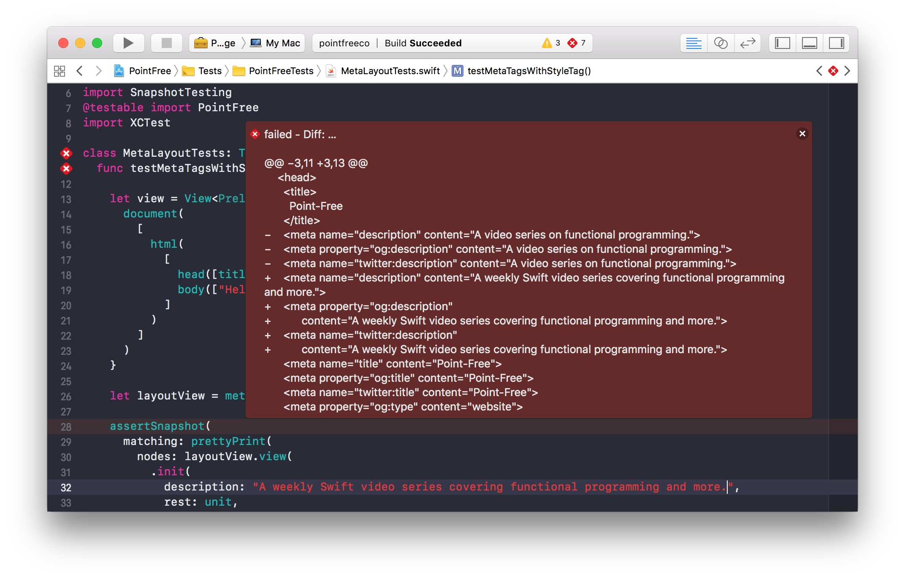
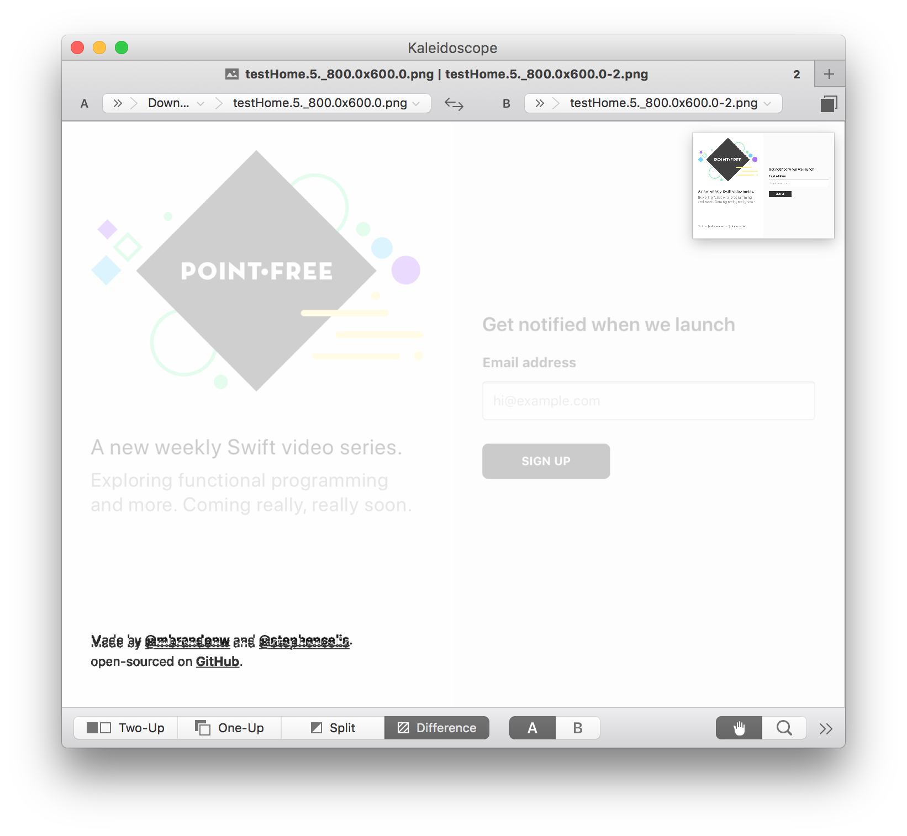

# swift-snapshot-testing

macOS [](https://circleci.com/gh/pointfreeco/swift-snapshot-testing) Linux [](https://travis-ci.org/pointfreeco/swift-snapshot-testing)

Automatically record app data into test assertions. Snapshot tests capture the entirety of a data structure and cover far more surface area than a typical unit test.

The design of this library has been covered in "[Snapshot Testing in Swift](http://www.stephencelis.com/2017/09/snapshot-testing-in-swift)".



## Stability

This library should be considered alpha, and not stable. Breaking changes will happen often.

## Installation

### Swift Package Manager

```swift
import PackageDescription

let package = Package(
  dependencies: [
    .package(url: "https://github.com/pointfreeco/swift-snapshot-testing.git", .branch("master")),
  ]
)
```

### Cocoapods

```ruby
target 'Tests' do
  pod 'SnapshotTesting', :git => 'https://github.com/pointfreeco/swift-snapshot-testing.git'
end
```

## Usage

Snapshot Testing provides an `assertSnapshot` function, which records data structures as text or images accordingly.

Here's how you might test a URL request you've prepared for your app's API client:

```swift
import SnapshotTesting
import XCTest

class ApiServiceTests: XCTestCase {
  func testUrlRequestPreparation() {
    let service = ApiService()
    let request = service
      .prepare(endpoint: .createArticle("Hello, world!"))

    assertSnapshot(matching: request)
  }
}
```

The above will render as the following text to `__Snapshots__/ApiServiceTests/testUrlRequestPreparation.0.txt`:

```
▿ https://api.site.com/articles?oauth_token=deadbeef
  ▿ url: Optional(https://api.site.com/articles?oauth_token=deadbeef)
    ▿ some: https://api.site.com/articles?oauth_token=deadbeef
      - _url: https://api.site.com/articles?oauth_token=deadbeef #0
        - super: NSObject
  - cachePolicy: 0
  - timeoutInterval: 60.0
  - mainDocumentURL: nil
  - networkServiceType: __ObjC.NSURLRequest.NetworkServiceType
  - allowsCellularAccess: true
  ▿ httpMethod: Optional("POST")
    - some: "POST"
  ▿ allHTTPHeaderFields: Optional(["App-Version": "42"])
    ▿ some: 1 key/value pairs
      ▿ (2 elements)
        - key: "App-Version"
        - value: "42"
  ▿ httpBody: Optional(19 bytes)
    ▿ some: "body=Hello%20world!"
  - httpBodyStream: nil
  - httpShouldHandleCookies: true
  - httpShouldUsePipelining: false
```

Renderable data will write as an image. This includes `UIImage`s and `NSImage`s, but also data that is typically viewed visually, like `UIView`s and `NSView`s.

Given a view:

``` swift
import SnapshotTesting
import XCTest

class HomepageTests: XCTestCase {
  func testRender() {
    let size = CGSize(width: 800, height: 600)
    let webView = UIWebView(frame: .init(origin: .zero, size: size))
    webView.loadHTMLString(renderHomepage())

    assertSnapshot(matching: webView)
  }
}
```

The above will write to an image on disk. If that image ever renders differently in the future, the assertion will fail and produce a diff for inspection.




## Related Tools

  - [`FBSnapshotTestCase`](https://github.com/facebook/ios-snapshot-test-case) helped introduce screen shot testing to a broad audience in the iOS community. Experience with it inspired the creation of this library.

  - [`Jest`](http://facebook.github.io/jest/) brought generalized snapshot testing to the front-end with a polished user experience. Several features of this library (diffing, tracking outdated snapshots) were directly influenced.


## License

This library is released under the MIT license. See [LICENSE](LICENSE) for details.
